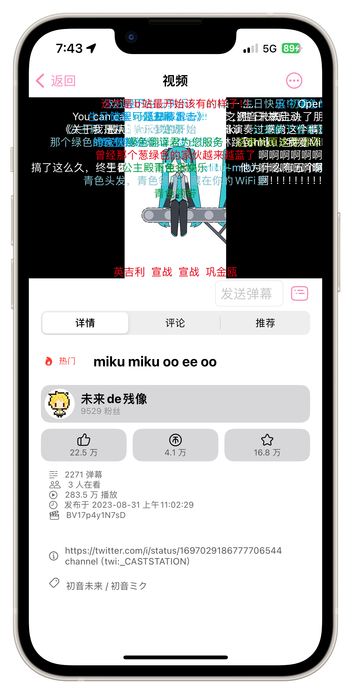
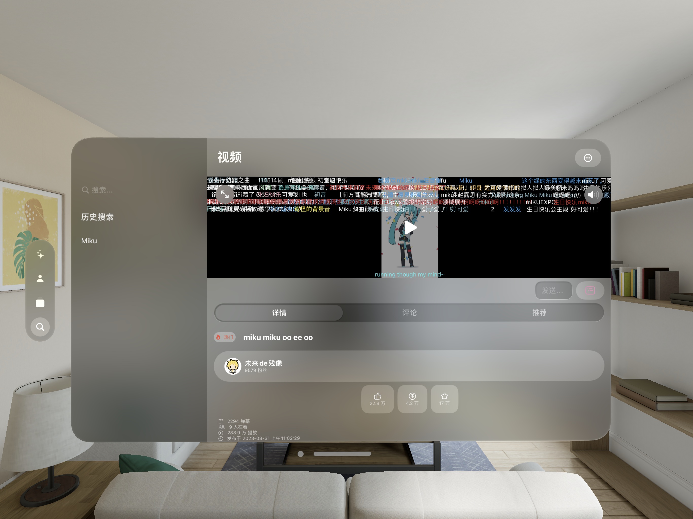

语言：简体中文｜<a href="./README_en.md">English</a>｜<a href="./README_ja.md">日本語</a>
<p align="center">
    
</p>

# 喵哩喵哩 - 跨平台的 Swift 原生B站客户端

&nbsp;
&nbsp;
&nbsp;
&nbsp;
&nbsp;
&nbsp;
&nbsp;
&nbsp;
&nbsp;

[](https://www.bestpractices.dev/projects/8415)

<p align="center">
    
</p>
<p align="center">
    
</p>
<p align="center">
    
</p>

## ✨功能
- 个性化推荐
- 登录账号
- 下载视频
- 查看视频详情（播放量、简介等）
- 查看视频评论
- 发送评论
- 查看推荐视频
- 视频操作（点赞、投币、收藏等）
- 用户详情页（粉丝、关注数，个性签名等）
- 用户视频、专栏
- 用户操作（关注、私信）
- 搜索（视频、UP主）
- 关注列表
- 收藏列表（收藏夹）
- 稍后再看（查看、添加）
- 动态查看

## ⬇️安装
### TestFlight
[此处](https://testflight.apple.com/join/TbuBT6ig)

## 🙌贡献
欢迎提交Issue和Pull Request帮助我们变得更好！

在 [/doc/dev](/doc/dev) 中查看开发/贡献相关文档

<details><summary>项目中的逆天代码片段</summary>

```swift
// UserDynamic/UserDynamicMainView.swift :322
                    dynamics.append([
                        "WithText": item.1["modules"]["module_dynamic"]["desc"]["text"].string ?? "",
                        "Type": BiliDynamicType(rawValue: item.1["type"].string ?? "DYNAMIC_TYPE_WORD") ?? .text,
                        "Draws": { () -> [[String: String]]? in
                            if BiliDynamicType(rawValue: item.1["type"].string ?? "DYNAMIC_TYPE_WORD") == .draw {
                                var dTmp = [[String: String]]()
                                for draw in item.1["modules"]["module_dynamic"]["major"]["draw"]["items"] {
                                    isDynamicImagePresented[itemForCount].append(false)
                                    dTmp.append(["Src": draw.1["src"].string ?? ""])
                                }
                                return dTmp
                            } else {
                                return nil
                            }
                        }(),
                        "Archive": { () -> [String: String]? in
                            if BiliDynamicType(rawValue: item.1["type"].string ?? "DYNAMIC_TYPE_WORD") == .video {
                                let archive = item.1["modules"]["module_dynamic"]["major"]["archive"]
                                return ["Pic": archive["cover"].string ?? "", "Title": archive["title"].string ?? "", "BV": archive["bvid"].string ?? "", "UP": item.1["modules"]["module_author"]["name"].string ?? "", "View": archive["stat"]["play"].string ?? "-1", "Danmaku": archive["stat"]["danmaku"].string ?? "-1"]
                            } else {
                                return nil
                            }
                        }(),
                        "Live": { () -> [String: String]? in
                            if BiliDynamicType(rawValue: item.1["type"].string ?? "DYNAMIC_TYPE_WORD") == .live {
                                do {
                                    let liveContentJson = try JSON(data: (item.1["modules"]["module_dynamic"]["major"]["live_rcmd"]["content"].string ?? "").data(using: .utf8) ?? Data())
                                    debugPrint(liveContentJson)
                                    return ["Cover": liveContentJson["live_play_info"]["cover"].string ?? "", "Title": liveContentJson["live_play_info"]["title"].string ?? "", "ID": String(liveContentJson["live_play_info"]["room_id"].int ?? 0), "Type": liveContentJson["live_play_info"]["area_name"].string ?? "", "ViewStr": liveContentJson["live_play_info"]["watched_show"]["text_large"].string ?? "-1"]
                                } catch {
                                    return nil
                                }
                            } else {
                                return nil
                            }
                        }(),
                        "Forward": { () -> [String: Any?]? in
                            if BiliDynamicType(rawValue: item.1["type"].string ?? "DYNAMIC_TYPE_WORD") == .forward {
                                let origData = item.1["orig"]
                                return [
                                    "WithText": origData["modules"]["module_dynamic"]["desc"]["text"].string ?? "",
                                    "Type": BiliDynamicType(rawValue: origData["type"].string ?? "DYNAMIC_TYPE_WORD") ?? .text,
                                    "Draws": { () -> [[String: String]]? in
                                        if BiliDynamicType(rawValue: origData["type"].string ?? "DYNAMIC_TYPE_WORD") == .draw {
                                            var dTmp = [[String: String]]()
                                            for draw in origData["modules"]["module_dynamic"]["major"]["draw"]["items"] {
                                                isDynamicImagePresented[itemForCount].append(false)
                                                dTmp.append(["Src": draw.1["src"].string ?? ""])
                                            }
                                            return dTmp
                                        } else {
                                            return nil
                                        }
                                    }(),
                                    "Archive": { () -> [String: String]? in
                                        if BiliDynamicType(rawValue: origData["type"].string ?? "DYNAMIC_TYPE_WORD") == .video {
                                            let archive = origData["modules"]["module_dynamic"]["major"]["archive"]
                                            return ["Pic": archive["cover"].string ?? "", "Title": archive["title"].string ?? "", "BV": archive["bvid"].string ?? "", "UP": origData["modules"]["module_author"]["name"].string ?? "", "View": archive["stat"]["play"].string ?? "-1", "Danmaku": archive["stat"]["danmaku"].string ?? "-1"]
                                        } else {
                                            return nil
                                        }
                                    }(),
                                    "Live": { () -> [String: String]? in
                                        if BiliDynamicType(rawValue: origData["type"].string ?? "DYNAMIC_TYPE_WORD") == .live {
                                            do {
                                                let liveContentJson = try JSON(data: (origData["modules"]["module_dynamic"]["major"]["live_rcmd"]["content"].string ?? "").data(using: .utf8) ?? Data())
                                                debugPrint(liveContentJson)
                                                return ["Cover": liveContentJson["live_play_info"]["cover"].string ?? "", "Title": liveContentJson["live_play_info"]["title"].string ?? "", "ID": String(liveContentJson["live_play_info"]["room_id"].int ?? 0), "Type": liveContentJson["live_play_info"]["area_name"].string ?? "", "ViewStr": liveContentJson["live_play_info"]["watched_show"]["text_large"].string ?? "-1"]
                                            } catch {
                                                return nil
                                            }
                                        } else {
                                            return nil
                                        }
                                    }(),
                                    "SenderPic": origData["modules"]["module_author"]["face"].string ?? "",
                                    "SenderName": origData["modules"]["module_author"]["name"].string ?? "",
                                    "SenderID": String(origData["modules"]["module_author"]["mid"].int ?? 0),
                                    "SendTimeStr": origData["modules"]["module_author"]["pub_time"].string ?? "0000/00/00",
                                    "SharedCount": String(origData["modules"]["module_stat"]["forward"]["count"].int ?? -1),
                                    "LikedCount": String(origData["modules"]["module_stat"]["like"]["count"].int ?? -1),
                                    "IsLiked": origData["modules"]["module_stat"]["like"]["status"].bool ?? false,
                                    "CommentCount": String(origData["modules"]["module_stat"]["comment"]["count"].int ?? -1),
                                    "DynamicID": origData["id_str"].string ?? ""
                                ]
                            } else {
                                return nil
                            }
                        }(),
                        "SenderPic": item.1["modules"]["module_author"]["face"].string ?? "",
                        "SenderName": item.1["modules"]["module_author"]["name"].string ?? "",
                        "SenderID": String(item.1["modules"]["module_author"]["mid"].int ?? 0),
                        "SendTimeStr": item.1["modules"]["module_author"]["pub_time"].string ?? "0000/00/00",
                        "SharedCount": String(item.1["modules"]["module_stat"]["forward"]["count"].int ?? -1),
                        "LikedCount": String(item.1["modules"]["module_stat"]["like"]["count"].int ?? -1),
                        "IsLiked": item.1["modules"]["module_stat"]["like"]["status"].bool ?? false,
                        "CommentCount": String(item.1["modules"]["module_stat"]["comment"]["count"].int ?? -1),
                        "DynamicID": item.1["id_str"].string ?? ""
                    ])
```

</details>

### 贡献流程
开启Pull Request->等待审查->修复问题（如果有）->等待CI完成编译性检查->合并到main（或Close Pull Request）

任何人（包括管理员）不可跳过上述步骤的任一部分。

## 📝版本号
喵哩喵哩在GitHub和TestFlight(与关于页上相同)上的版本号**不同**，因为如果在TestFlight上递增版本号，App 需要重新接受审核，而递增 Build 版本则不用。

因此，我们在TestFlight上仅仅递增 Build 号，而GitHub上尽可能使用语义化版本，我们更推荐使用GitHub上的版本号来引用喵哩喵哩程序。

## 💬用户评价
~~用过的都说好~~

> [!TIP]
> 当我发现我可以在Apple Watch上直接浏览哔哩哔哩的内容时，我的兴奋可想而知。这要归功于“喵哩喵哩”这款小巧而强大的应用。作为一个整日不离手的智能手表，Apple Watch对于我来说早已不止是时间显示和运动追踪，它逐渐演变成了我的日常生活中的小秘书。但现在，随着“喵哩喵哩”的出现，它的功能越发丰富，我的娱乐生活也因此而提升。
> 
> 首先要赞赏的是“喵哩喵哩”的设计。这款应用针对Apple Watch的小屏幕做了极佳的优化。它的界面干净且直观，方便用户在屏幕尺寸有限的情况下，快速地浏览和搜索内容。字体大小和按钮布局考虑到了触控的便利性，不会让人觉得拥挤或难以操作。
> 
> 其次，功能上的实用性也是我极大的喜爱之处。虽然Apple Watch的屏幕并不适合长时间观看视频，但“喵哩喵哩”让我能在空闲之余迅速地查看更新，了解最新动态，甚至在不便拿出手机的情况下观看一些短视频或者收听up主的声音。这样的体验让我感到十分便捷。
> 
> 总的来说，“喵哩喵哩”不仅为我日常的Apple Watch使用增添了乐趣，同时也满足了我作为一个视频内容爱好者的需求。它是那些喜欢在任何时间地点都保持在线的用户的必备应用。
> 
> ————陵长镜

> [!TIP]
> 如果我高一，
> 
> 我会写七言情诗，引经据典行行不提喜欢；
> 
> 如果我高二,
> 
> 我会写千字散文，辞藻华丽句句点名爱意；
> 
> 如果我高三，
> 
> 我会写一纸情书，哲思神秘再融进荣格和弗洛伊;
> 
> 可惜我现在幼儿园，我只会说，喵哩喵哩我好喜欢你，喵哩喵哩😭😭你带我走吧🚗……喵哩喵哩🏃…喵哩喵哩🏃…喵哩喵哩🧎没有你我怎么活啊😭
> 
> ————Miku

> [!TIP]
> 🐱🍐🐱🍐👍，🈶✨🧑‍🎨、❤️🌐，➕⏰🔄。🧑‍💻🤝👂👥🗣️，🙅⛓️‍💥✍️⏩。
> 
> 🐱🍐🐱🍐🤝🙋👋🐟，🙋💗 🐱🍐🐱🍐
>
> ————ThreeManager785

> [!TIP]
> 你说的对，但是喵哩喵哩是由 Darock 研发的一款开源世界B站第三方 Apple Watch 客户端。游戏发生在一个名为“学校”的真实世界，在这里，被老师选中的人会被没收手机，引导 Apple Watch 之力。你将扮演一位名为“学生”的神秘角色，在教室中浏览性格各异能力独特的视频们，和他们一起击败强敌，找回失散的MEMZ。

## 重要信息
> [!IMPORTANT]
> 本 App 中的视频等数据来自 Bilibili，版权属于 Bilibili 以及视频创作者。
>
> Darock 与 Bilibili 并无合作关系，本 App 仅作学习用途
>
> 本 App 所有源代码开源，仅用于学习 Swift 开发。
