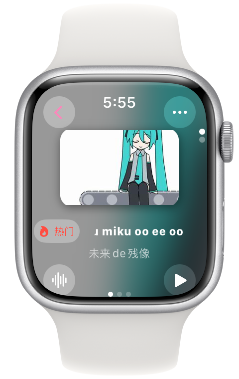

Language: <a href="./README.md">简体中文</a>｜English
<p align="center">
    
</p>

# Meowbili - Bilibili client on Apple Watch

&nbsp;
&nbsp;
&nbsp;
&nbsp;
&nbsp;
&nbsp;
&nbsp;
&nbsp;
&nbsp;


<p align="center">
    
</p>

## ✨Features
- Customized Suggestion
- Account Login
- Video Download
- View Video Details（Play counts、introduction...）
- View Video Comments
- Send Comments
- View Suggested Video
- Video Actions（Like、Throw Coins、Add to favorites...）
- User Detail Page（Fans、Follows count，User bio...）
- User Videos and Articles
- User Actions（Follow、D.M.）
- Search（Videos、Users）
- Follow List
- Favorites（Folder）
- Watch Later（View、Add）
- View Moments

## ⬇️Install
### TestFlight
[Here](https://testflight.apple.com/join/TbuBT6ig)

## 🙌Contribute
Welcome to open issues and pull requests to help us get better.

View contribute/develop document at [/doc/dev](/doc/dev) 

<details><summary>Some unreasonable code clip in this project</summary>

```swift
// UserDynamic/UserDynamicMainView.swift :322
                    dynamics.append([
                        "WithText": item.1["modules"]["module_dynamic"]["desc"]["text"].string ?? "",
                        "Type": BiliDynamicType(rawValue: item.1["type"].string ?? "DYNAMIC_TYPE_WORD") ?? .text,
                        "Draws": { () -> [[String: String]]? in
                            if BiliDynamicType(rawValue: item.1["type"].string ?? "DYNAMIC_TYPE_WORD") == .draw {
                                var dTmp = [[String: String]]()
                                for draw in item.1["modules"]["module_dynamic"]["major"]["draw"]["items"] {
                                    isDynamicImagePresented[itemForCount].append(false)
                                    dTmp.append(["Src": draw.1["src"].string ?? ""])
                                }
                                return dTmp
                            } else {
                                return nil
                            }
                        }(),
                        "Archive": { () -> [String: String]? in
                            if BiliDynamicType(rawValue: item.1["type"].string ?? "DYNAMIC_TYPE_WORD") == .video {
                                let archive = item.1["modules"]["module_dynamic"]["major"]["archive"]
                                return ["Pic": archive["cover"].string ?? "", "Title": archive["title"].string ?? "", "BV": archive["bvid"].string ?? "", "UP": item.1["modules"]["module_author"]["name"].string ?? "", "View": archive["stat"]["play"].string ?? "-1", "Danmaku": archive["stat"]["danmaku"].string ?? "-1"]
                            } else {
                                return nil
                            }
                        }(),
                        "Live": { () -> [String: String]? in
                            if BiliDynamicType(rawValue: item.1["type"].string ?? "DYNAMIC_TYPE_WORD") == .live {
                                do {
                                    let liveContentJson = try JSON(data: (item.1["modules"]["module_dynamic"]["major"]["live_rcmd"]["content"].string ?? "").data(using: .utf8) ?? Data())
                                    debugPrint(liveContentJson)
                                    return ["Cover": liveContentJson["live_play_info"]["cover"].string ?? "", "Title": liveContentJson["live_play_info"]["title"].string ?? "", "ID": String(liveContentJson["live_play_info"]["room_id"].int ?? 0), "Type": liveContentJson["live_play_info"]["area_name"].string ?? "", "ViewStr": liveContentJson["live_play_info"]["watched_show"]["text_large"].string ?? "-1"]
                                } catch {
                                    return nil
                                }
                            } else {
                                return nil
                            }
                        }(),
                        "Forward": { () -> [String: Any?]? in
                            if BiliDynamicType(rawValue: item.1["type"].string ?? "DYNAMIC_TYPE_WORD") == .forward {
                                let origData = item.1["orig"]
                                return [
                                    "WithText": origData["modules"]["module_dynamic"]["desc"]["text"].string ?? "",
                                    "Type": BiliDynamicType(rawValue: origData["type"].string ?? "DYNAMIC_TYPE_WORD") ?? .text,
                                    "Draws": { () -> [[String: String]]? in
                                        if BiliDynamicType(rawValue: origData["type"].string ?? "DYNAMIC_TYPE_WORD") == .draw {
                                            var dTmp = [[String: String]]()
                                            for draw in origData["modules"]["module_dynamic"]["major"]["draw"]["items"] {
                                                isDynamicImagePresented[itemForCount].append(false)
                                                dTmp.append(["Src": draw.1["src"].string ?? ""])
                                            }
                                            return dTmp
                                        } else {
                                            return nil
                                        }
                                    }(),
                                    "Archive": { () -> [String: String]? in
                                        if BiliDynamicType(rawValue: origData["type"].string ?? "DYNAMIC_TYPE_WORD") == .video {
                                            let archive = origData["modules"]["module_dynamic"]["major"]["archive"]
                                            return ["Pic": archive["cover"].string ?? "", "Title": archive["title"].string ?? "", "BV": archive["bvid"].string ?? "", "UP": origData["modules"]["module_author"]["name"].string ?? "", "View": archive["stat"]["play"].string ?? "-1", "Danmaku": archive["stat"]["danmaku"].string ?? "-1"]
                                        } else {
                                            return nil
                                        }
                                    }(),
                                    "Live": { () -> [String: String]? in
                                        if BiliDynamicType(rawValue: origData["type"].string ?? "DYNAMIC_TYPE_WORD") == .live {
                                            do {
                                                let liveContentJson = try JSON(data: (origData["modules"]["module_dynamic"]["major"]["live_rcmd"]["content"].string ?? "").data(using: .utf8) ?? Data())
                                                debugPrint(liveContentJson)
                                                return ["Cover": liveContentJson["live_play_info"]["cover"].string ?? "", "Title": liveContentJson["live_play_info"]["title"].string ?? "", "ID": String(liveContentJson["live_play_info"]["room_id"].int ?? 0), "Type": liveContentJson["live_play_info"]["area_name"].string ?? "", "ViewStr": liveContentJson["live_play_info"]["watched_show"]["text_large"].string ?? "-1"]
                                            } catch {
                                                return nil
                                            }
                                        } else {
                                            return nil
                                        }
                                    }(),
                                    "SenderPic": origData["modules"]["module_author"]["face"].string ?? "",
                                    "SenderName": origData["modules"]["module_author"]["name"].string ?? "",
                                    "SenderID": String(origData["modules"]["module_author"]["mid"].int ?? 0),
                                    "SendTimeStr": origData["modules"]["module_author"]["pub_time"].string ?? "0000/00/00",
                                    "SharedCount": String(origData["modules"]["module_stat"]["forward"]["count"].int ?? -1),
                                    "LikedCount": String(origData["modules"]["module_stat"]["like"]["count"].int ?? -1),
                                    "IsLiked": origData["modules"]["module_stat"]["like"]["status"].bool ?? false,
                                    "CommentCount": String(origData["modules"]["module_stat"]["comment"]["count"].int ?? -1),
                                    "DynamicID": origData["id_str"].string ?? ""
                                ]
                            } else {
                                return nil
                            }
                        }(),
                        "SenderPic": item.1["modules"]["module_author"]["face"].string ?? "",
                        "SenderName": item.1["modules"]["module_author"]["name"].string ?? "",
                        "SenderID": String(item.1["modules"]["module_author"]["mid"].int ?? 0),
                        "SendTimeStr": item.1["modules"]["module_author"]["pub_time"].string ?? "0000/00/00",
                        "SharedCount": String(item.1["modules"]["module_stat"]["forward"]["count"].int ?? -1),
                        "LikedCount": String(item.1["modules"]["module_stat"]["like"]["count"].int ?? -1),
                        "IsLiked": item.1["modules"]["module_stat"]["like"]["status"].bool ?? false,
                        "CommentCount": String(item.1["modules"]["module_stat"]["comment"]["count"].int ?? -1),
                        "DynamicID": item.1["id_str"].string ?? ""
                    ])
```

</details>

### Contribute Steps
Open an Pull Request->Wait for review->Repair problem (if have)->Wait for compile check->merge to main（or Close Pull Request）

Everyone（including administrators）cannot skip any steps.

## 📝Version Number
Meowbili's Version number is **different** on GitHub and TestFlight(Same on about page). Because if add Version number on Testflight, app need to review by Apple. But if only add build number can prevent this.

So, we only add build number on Testflight. However, on Github we use easy to understand version number. We recommanded to use version number on Github to identity Meowbili.

## 💬User Comments
~~When people used this, they all say good~~

> [!TIP]
> When I found that I could browse Bilibili directly on Apple Watch, my excitement was imaginable. This is thanks to the small and powerful application of Meowbili.As a smart watch that never leaves my hands all day long, Apple Watch is not only a time display and motion tracking for me, but also has gradually evolved into a little secretary in my daily life. But now, with the emergence of Meowbili, its functions have become richer and richer, and my entertainment life has also improved.
> 
> The first thing to appreciate is the design of Meowbili. This app is excellently optimized for the small screen of Apple Watch. Its interface is clean and intuitive, which is convenient for users to quickly browse and search for content with limited screen size. The font size and button layout take into account the convenience of touch and will not make people feel crowded or difficult to operate.
> 
> Secondly, the practicality of functions is also my favorite. Although the screen of Apple Watch is not suitable for watching videos for a long time, Meowbili allows me to quickly check the updates in my spare time, keep abreast of the latest developments, and even watch some short videos or listen to the voice of the uploader when it is inconvenient to take out the mobile phone. This kind of experience makes me feel very convenient.
> 
> Generally speaking, Meowbili not only adds fun to my daily use of Apple Watch, but also meets my needs as a video content enthusiast. It is a must-have application for users who like to stay online at any time and anywhere.
> 
> ————Ling Changjing

> [!TIP]
> If I am first year in high school,
> 
> I will write seven romance poems, citing the scriptures and not mentioning what I like;
> 
> If I am second year in high school,
> 
> I can write thousands of words of prose, and the words are gorgeous and full of love;
> 
> If I am second year in high school,
> 
> I will write a love letter, and the mystery of philosophy will be integrated into Jung and Freud;
> 
> It's a pity that I'm in kindergarten now, and I can only say, Meowbili 😭😭 take me away 🚗... Meowbili 🏃... Meowbili 🧎 how can I live without you 😭
> 
> ————Miku

> [!TIP]
> 🐱🍐🐱🍐👍，🈶✨🧑‍🎨、❤️🌐，➕⏰🔄。🧑‍💻🤝👂👥🗣️，🙅⛓️‍💥✍️⏩。
> 
> 🐱🍐🐱🍐🤝🙋👋🐟，🙋💗 🐱🍐🐱🍐
>
> ————ThreeManager785

> [!TIP]
> You're right, but Meowbili is an open source world Bilivili third-party Apple Watch client developed by Darock. The game takes place in a real world called "School", where the person selected by the teacher will confiscate the mobile phone and guide the power of Apple Watch. You will play a mysterious role named "student", browse videos with different personalities and abilities in the classroom, defeat the strong enemy with them, and find the lost MEMZ.

> [!TIP]
> Bashan Chushui is desolate, and the plane is rectangular coordinate system.
> 
> responsibility,aw can also watch videos
> 
> High potassium fermentic acid to produce oxygen, Meowbili is so NB
