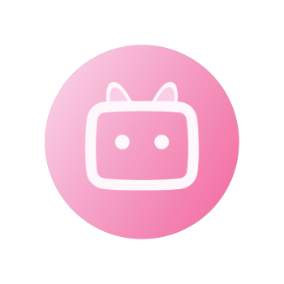
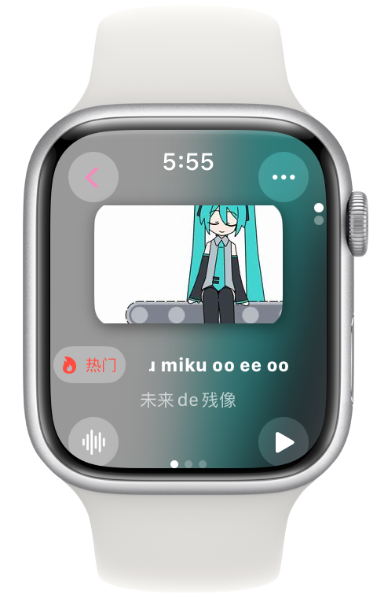

言語：<a href="./README.md">简体中文</a>｜<a href="./README_en.md">English</a>｜日本語
<p align="center">
    
</p>

# 喵哩喵哩 - Apple Watch上のB站クライアント

&nbsp;
&nbsp;
&nbsp;
&nbsp;
&nbsp;
&nbsp;
&nbsp;
&nbsp;
&nbsp;


<p align="center">
    
</p>

## ✨機能
- 個別推奨
- アカウントにログイン
- ビデオをダウンロードする
- ビデオの詳細を見る（再生回数、概要など）
- ビデオのコメントを見る
- コメントを送信する
- 推奨ビデオを見る
- ビデオ操作（いいね、コイン投入、お気に入りなど）
- ユーザー詳細ページ（ファン、フォロー数、個性的な署名など）
- ユーザービデオ、専門コラム
- ユーザー操作（フォロー、プライベートメッセージ）
- 検索（ビデオ、UP主）
- お気に入りリスト 
 - 保存リスト(ブックマーク)
 - 後で見る(表示, 追加)
 - 動态チェック

## ⬇️インストール
### TestFlight
[ここで](https://testflight.apple.com/join/TbuBT6ig)

## 🙌貢献
問題やプルリクエストの提出を歓迎します！私たちがより良くなるお手伝いをしてください！

[/doc/dev](/doc/dev)で開発/貢献に関する文書をご覧ください。

<details><summary>プロジェクト中の逆転コードスニペット</summary>

```swift
// UserDynamic/UserDynamicMainView.swift :322
                    dynamics.append([
                        "WithText": item.1["modules"]["module_dynamic"]["desc"]["text"].string ?? "",
                        "Type": BiliDynamicType(rawValue: item.1["type"].string ?? "DYNAMIC_TYPE_WORD") ?? .text,
                        "Draws": { () -> [[String: String]]? in
                            if BiliDynamicType(rawValue: item.1["type"].string ?? "DYNAMIC_TYPE_WORD") == .draw {
                                var dTmp = [[String: String]]()
                                for draw in item.1["modules"]["module_dynamic"]["major"]["draw"]["items"] {
                                    isDynamicImagePresented[itemForCount].append(false)
                                    dTmp.append(["Src": draw.1["src"].string ?? ""])
                                }
                                return dTmp
                            } else {
                                return nil
                            }
                        }(),
                        "Archive": { () -> [String: String]? in
                            if BiliDynamicType(rawValue: item.1["type"].string ?? "DYNAMIC_TYPE_WORD") == .video {
                                let archive = item.1["modules"]["module_dynamic"]["major"]["archive"]
                                return ["Pic": archive["cover"].string ?? "", "Title": archive["title"].string ?? "", "BV": archive["bvid"].string ?? "", "UP": item.1["modules"]["module_author"]["name"].string ?? "", "View": archive["stat"]["play"].string ?? "-1", "Danmaku": archive["stat"]["danmaku"].string ?? "-1"]
                            } else {
                                return nil
                            }
                        }(),
                        "Live": { () -> [String: String]? in
                            if BiliDynamicType(rawValue: item.1["type"].string ?? "DYNAMIC_TYPE_WORD") == .live {
                                do {
                                    let liveContentJson = try JSON(data: (item.1["modules"]["module_dynamic"]["major"]["live_rcmd"]["content"].string ?? "").data(using: .utf8) ?? Data())
                                    debugPrint(liveContentJson)
                                    return ["Cover": liveContentJson["live_play_info"]["cover"].string ?? "", "Title": liveContentJson["live_play_info"]["title"].string ?? "", "ID": String(liveContentJson["live_play_info"]["room_id"].int ?? 0), "Type": liveContentJson["live_play_info"]["area_name"].string ?? "", "ViewStr": liveContentJson["live_play_info"]["watched_show"]["text_large"].string ?? "-1"]
                                } catch {
                                    return nil
                                }
                            } else {
                                return nil
                            }
                        }(),
                        "Forward": { () -> [String: Any?]? in
                            if BiliDynamicType(rawValue: item.1["type"].string ?? "DYNAMIC_TYPE_WORD") == .forward {
                                let origData = item.1["orig"]
                                return [
                                    "WithText": origData["modules"]["module_dynamic"]["desc"]["text"].string ?? "",
                                    "Type": BiliDynamicType(rawValue: origData["type"].string ?? "DYNAMIC_TYPE_WORD") ?? .text,
                                    "Draws": { () -> [[String: String]]? in
                                        if BiliDynamicType(rawValue: origData["type"].string ?? "DYNAMIC_TYPE_WORD") == .draw {
                                            var dTmp = [[String: String]]()
                                            for draw in origData["modules"]["module_dynamic"]["major"]["draw"]["items"] {
                                                isDynamicImagePresented[itemForCount].append(false)
                                                dTmp.append(["Src": draw.1["src"].string ?? ""])
                                            }
                                            return dTmp
                                        } else {
                                            return nil
                                        }
                                    }(),
                                    "Archive": { () -> [String: String]? in
                                        if BiliDynamicType(rawValue: origData["type"].string ?? "DYNAMIC_TYPE_WORD") == .video {
                                            let archive = origData["modules"]["module_dynamic"]["major"]["archive"]
                                            return ["Pic": archive["cover"].string ?? "", "Title": archive["title"].string ?? "", "BV": archive["bvid"].string ?? "", "UP": origData["modules"]["module_author"]["name"].string ?? "", "View": archive["stat"]["play"].string ?? "-1", "Danmaku": archive["stat"]["danmaku"].string ?? "-1"]
                                        } else {
                                            return nil
                                        }
                                    }(),
                                    "Live": { () -> [String: String]? in
                                        if BiliDynamicType(rawValue: origData["type"].string ?? "DYNAMIC_TYPE_WORD") == .live {
                                            do {
                                                let liveContentJson = try JSON(data: (origData["modules"]["module_dynamic"]["major"]["live_rcmd"]["content"].string ?? "").data(using: .utf8) ?? Data())
                                                debugPrint(liveContentJson)
                                                return ["Cover": liveContentJson["live_play_info"]["cover"].string ?? "", "Title": liveContentJson["live_play_info"]["title"].string ?? "", "ID": String(liveContentJson["live_play_info"]["room_id"].int ?? 0), "Type": liveContentJson["live_play_info"]["area_name"].string ?? "", "ViewStr": liveContentJson["live_play_info"]["watched_show"]["text_large"].string ?? "-1"]
                                            } catch {
                                                return nil
                                            }
                                        } else {
                                            return nil
                                        }
                                    }(),
                                    "SenderPic": origData["modules"]["module_author"]["face"].string ?? "",
                                    "SenderName": origData["modules"]["module_author"]["name"].string ?? "",
                                    "SenderID": String(origData["modules"]["module_author"]["mid"].int ?? 0),
                                    "SendTimeStr": origData["modules"]["module_author"]["pub_time"].string ?? "0000/00/00",
                                    "SharedCount": String(origData["modules"]["module_stat"]["forward"]["count"].int ?? -1),
                                    "LikedCount": String(origData["modules"]["module_stat"]["like"]["count"].int ?? -1),
                                    "IsLiked": origData["modules"]["module_stat"]["like"]["status"].bool ?? false,
                                    "CommentCount": String(origData["modules"]["module_stat"]["comment"]["count"].int ?? -1),
                                    "DynamicID": origData["id_str"].string ?? ""
                                ]
                            } else {
                                return nil
                            }
                        }(),
                        "SenderPic": item.1["modules"]["module_author"]["face"].string ?? "",
                        "SenderName": item.1["modules"]["module_author"]["name"].string ?? "",
                        "SenderID": String(item.1["modules"]["module_author"]["mid"].int ?? 0),
                        "SendTimeStr": item.1["modules"]["module_author"]["pub_time"].string ?? "0000/00/00",
                        "SharedCount": String(item.1["modules"]["module_stat"]["forward"]["count"].int ?? -1),
                        "LikedCount": String(item.1["modules"]["module_stat"]["like"]["count"].int ?? -1),
                        "IsLiked": item.1["modules"]["module_stat"]["like"]["status"].bool ?? false,
                        "CommentCount": String(item.1["modules"]["module_stat"]["comment"]["count"].int ?? -1),
                        "DynamicID": item.1["id_str"].string ?? ""
                    ])
```

</details>

### 貢献プロセス
Pull Requestを開始->レビュー待ち->問題の修正（もしあれば）->CIがコンパイルチェックを完了するのを待つ->mainにマージ（またはPull Requestを閉じる）

誰も（管理者を含む）上記の手順の一部をスキップすることはできません。

## 📝バージョン番号
喵哩喵哩のバージョン番号はGitHubとTestFlight（Aboutページと同じ）で**異なります**。これは、TestFlightでバージョン番号を増やすと、アプリが再審査を受ける必要があるためです。一方、ビルド版の番号を増やすだけでは不要です。

したがって、私たちはTestFlight上ではビルド番号だけを増やし、GitHub上では可能な限りセマンティックバージョニングを使用します。私たちは喵哩喵哩プログラムへの参照についてはGitHub上のバージョン番号の使用を推奨しています。

## 💬ユーザー評価
~~使った人みんなが良いと言っています~~

> [!TIP]
> 私がApple Watchで直接ビリビリのコンテンツを閲覧できることに気づいた時、その興奮は想像に難くない。これは「喵哩喵哩」という小さくて強力なアプリケーションのおかげだ。一日中手放しません智能手表として、Apple Watchは私にとって時間表示や運動追跡以上のものになりました。それは徐々に私の日常生活中の秘書的存在に変わっています。しかし今、「喵哩喵哩」が登場したことで、その機能がますます豊富になり、エンタメライフも向上しました。
> 
> まず賞賛すべきは「喵哩喵哩」のデザインです。このアプリケーションはApple Watch の小さい画面を最大限利用するよう最適化されています。インタフェースがクリーンで直感的であり、スクリーンサイズが限られた状況下でも素早くコンテンツをブラウズしたり検索したりすることを可能にします。フォントサイズやボタングレートアップでは触覚操作性を考慮しており、混雑感や操作困難感を感じさせません。
> 
> 次に、機能の実用性も私が大いに気に入っています。Apple Watch の画面は長時間ビデオを視聴するのに適していないかもしれませんが、「喵哩喵哩」では空き時間で素早く更新情報をチェックしたり、最新動向を把握したり、またはスマホを取り出すことが難しい状況でもショートムービーを見たりup主の声を聞くことができます。このような体験は非常に便利だと感じています。
> 
> 全体的に言えば、「喵哩喵哩」は私の日常的なApple Watch使用経験へ楽しさを追加するだけでなく、ビデオコンテンツ愛好者としての要求も満たしています。それはどこでも何時でもオンラインであることが好きなユーザー必須アプリです。
> 
> ————陵长镜

> [!TIP]
> もし私が高校1年生なら、
> 
> 七言詩を書きます、引用と典拠で好きだとは一言も言わず；
> 
> もし私が高校2年生なら、
>
> 千字の散文を書きます、華麗な語彙で愛情を名指しする；
>
> もし私が高校3年生なら、
>
> 恋文一枚を書きます、哲学的思考と神秘性をユングやフロイトに溶け込ませて。
>
> でも残念なことに今は幼稚園児ですから、「喵哩喵哩あなたのこと大好き。喵哩喵哩😭😭連れて行って🚗…… 喵哩喵哩🏃… 喵哩喵哩🏃… 喵哩喵哩🧎あなたがいないとどうやって生きるんだろう😭」しか言えません。
> 
> ————Miku

> [!TIP]
> 🐱🍐🐱🍐👍，🈶✨🧑‍🎨、❤️🌐，➕⏰🔄。🧑‍💻🤝👂👥🗣️，🙅⛓️‍💥✍️⏩。
> 
> 🐱🍐🐱🍐🤝🙋👋🐟，🙋💗 🐱🍐🐱🍐
>
> ————ThreeManager785

> [!TIP]
> あなたの言う通りですが、喵哩喵哩はDarockによって開発されたオープンソースの世界Bサイト第三者Apple Watchクライアントです。ゲームは「学校」という現実世界で展開し、ここでは教師に選ばれた人々の携帯電話が没収され、Apple Watchの力を引き出します。あなたは「学生」という神秘的なキャラクターを演じることになります。教室で個性豊かで特技を持つビデオを見て回り、彼らと一緒に強大な敵を打ち負かし、失われたMEMZを取り戻すことになるでしょう。

## 重要な情報
> [!IMPORTANT]
> このアプリ内のビデオなどのデータはBilibiliから提供されており、著作権はBilibili及びビデオ制作者に帰属します。
>
> DarockとBilibiliとの間に協力関係はありません。このアプリは学習目的だけで使用されます。
>
> このアプリの全ソースコードが公開されており、Swift開発を学ぶためだけに使用されます。
